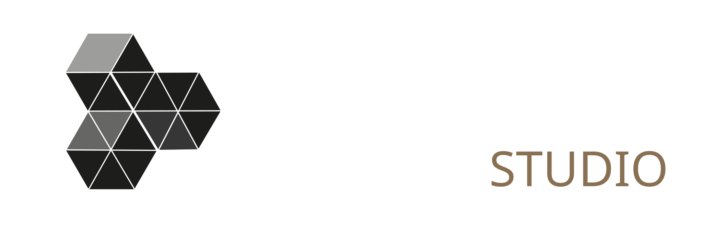

<!-- ══════════════════════════════════════════════════════════════════
     VISUARTE STUDIO · Perfil de GitHub
     Identidad: rama MADRE (familia fuego). La Llama (oscura) · La Brasa (clara)
     Acento La Llama #E88256 · borde #9A6B40 · Fuente: data/diseno/visuarte_identidad/
     ══════════════════════════════════════════════════════════════════ -->

<picture>
  <source media="(prefers-color-scheme: dark)" srcset="assets/visuarte-logo-h-llama.svg">
  <source media="(prefers-color-scheme: light)" srcset="assets/visuarte-logo-h-brasa.svg">
  
</picture>

  

 

**Diseño que además entiende el producto digital.** Identidad, dirección de arte, vídeo y web —
todo desde la misma casa, del archivo al objeto.

---

### Actividad

---

### Selección

---

### Herramientas

**Diseño**

**Frontend**

**Sistemas**

---

Del fuego al vacío.

