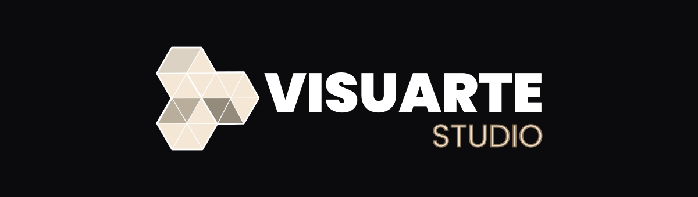

<!-- ══════════════════════════════════════════════════════════════════
     VISUARTE STUDIO · Perfil de GitHub
     Canon TIERRAS-MAPI (La Llama) · Fuego #D76742 · Negro #08080d
     Tarjetas: github-stats-extended · Banner: capsule-render
     ══════════════════════════════════════════════════════════════════ -->

 

**Diseño que además entiende el producto digital.** Identidad, dirección de arte, vídeo y web —
todo desde la misma casa, del archivo al objeto.

---

### Actividad

---

### Selección

---

### Herramientas

**Diseño**

**Frontend**

**Sistemas**

---

Del fuego al vacío.

